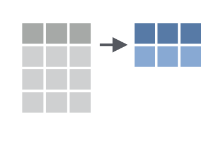

```{r setup, include=FALSE}
knitr::opts_chunk$set(echo = TRUE)
```


# Load Packages

Let's load the `tidyverse` package.  

```{r}
library(tidyverse)
library(readxl)
library(janitor)
```

# Import NHANES Data

Let's import our data using `read_csv`. Note that the NHANES data is in the data directory so we need to include that.

```{r}
nhanes <- read_csv("data/nhanes.csv")
```

Let's see what our data looks like.

```{r}
nhanes
```


# select


With `select` we can select variables from the larger data frame.

```{r}
nhanes %>% 
  select(age)
```


We can also use `select` for multiple variables:

```{r}
nhanes %>% 
  select(age, education)
```


We can `select` a range of columns using the var1:var2 pattern

```{r}
nhanes %>% 
  select(phys_active:smoke_now)
```


We can drop variables using the -var format:


```{r}
nhanes %>% 
  select(-id)
```

We can drop a set of variables using the -(var1:var2) format:

```{r}
nhanes %>% 
  select(-(id:age_decade))
```

We can drop a set of variables using the -(var1:var2) format. Drop the variables from `health_gen` to the end.

```{r}
nhanes %>% 
  select(health_gen:last_col())
```

```{r}
nhanes %>% 
  select(1:10)
```

```{r}
nhanes %>% 
  select(contains("phys"))
```


# mutate


We use `mutate` we make new variables or change existing ones. 

We can use `mutate` in three ways:

Create a **new variable with a specific value**

```{r}
# Make country variable
nhanes %>% 
  mutate(country = "United States") %>% 
  select(country)
  
```


Create a **new variable based on other variables**

```{r}
nhanes %>% 
  mutate(height_inches = height / 2.54) %>% 
  select(height, height_inches)
```

Change an **existing variable**

```{r}
nhanes %>% 
  mutate(height = height / 2.54) %>% 
  select(height)
```


# A Brief Interlude

## Comparisons

```{r echo = FALSE}
tibble::tribble(
  ~Operator, ~Description, ~Usage,
  "<", "less than", "x < y",
  "<=", "less than or equal to", "x <= y",
  ">", "greater than", "x > y",
  ">=", "greater than or equal to", "x >= y",
  "==", "exactly equal to", "x == y",
  "!=", "not equal to", "x != y",
  "%in%", "group membership", "x %in% y",
)
```


# filter


We use `filter` to choose a subset of observations.

We use `==` to filter all observations that meet the criteria.


```{r}
nhanes %>% 
  filter(gender == "female") %>% 
  select(gender)
```

We use `!=` to select all observations that don't meet the criteria.

```{r}
nhanes %>% 
  filter(work != "Working") %>% 
  select(work)
```


We can use `%in%` to only include responses that much a group. 

```{r}
nhanes %>% 
  filter(health_gen %in% c("Good", "Vgood", "Excellent")) %>% 
  select(health_gen)

nhanes %>% 
  filter(health_gen == "Good" | health_gen == "Vgood" | health_gen == "Excellent") %>% 
  select(health_gen)
```


We can chain together multiple `filter` functions. 

```{r}
nhanes %>% 
  filter(gender == "male") %>% 
  filter(health_gen %in% c("Good", "Vgood", "Excellent")) %>% 
  select(gender, health_gen)
```


We can use `<`, `>`, `<=`, and `=>` for numeric data.

```{r}
nhanes %>% 
  filter(age >= 50) %>% 
  select(age)
```

```{r}
nhanes %>% 
  filter(str_detect(education, "College"))
```


# summarize




With `summarize`, we can go from a complete dataset down to a summary.

We use these functions with `summarize`.

```{r echo = FALSE}
tibble::tribble(
  ~Description, ~Usage,
  "number", "n()",
  "sum", "sum(x)",
  "minimum", "min(x)",
  "maximum", "max(x)",
  "mean", "mean(x)",
  "median", "median(x)",
  "standard deviation", "sd(x)",
  "variance", "var(x)",
  "rank", "rank(x)"
)
```


Let's calculate the mean number of days in which respondents report being physically active.

```{r}
nhanes %>% 
  summarize(mean_days_phys_active = mean(phys_active_days))
```

This doesn't work! Notice what the result is. 

We need to add `na.rm = TRUE` to tell R to drop `NA` values.

```{r}
nhanes %>% 
  summarize(mean_days_phys_active = mean(phys_active_days,
                                         na.rm = TRUE))
```

```{r}
nhanes %>% 
  drop_na(phys_active_days) %>% 
  summarize(mean_days_phys_active = mean(phys_active_days))
```


We can have multiple arguments in each usage of `summarize`. Let's add the median along with the mean.

```{r}
nhanes %>% 
  summarize(mean_days_phys_active = mean(phys_active_days,
                                         na.rm = TRUE),
            median_days_phys_active = median(phys_active_days,
                                             na.rm = TRUE),
            number_of_responses = n())
```
```{r}
nhanes %>% 
  drop_na(phys_active_days) %>% 
  summarize(mean_days_phys_active = mean(phys_active_days,
                                         na.rm = TRUE),
            median_days_phys_active = median(phys_active_days,
                                             na.rm = TRUE),
            number_of_responses = n())
```


```{r}
nhanes %>% 
   summarize(mean_hours_sleep = mean(sleep_hrs_night, na.rm =TRUE),
minimum_hours_sleep = min(sleep_hrs_night, na.rm =TRUE))

```


```{r}
nhanes %>%
  summarize(mean_hours_sleep = mean(sleep_hrs_night, na.rm =TRUE),
minimum_hours_sleep = min(sleep_hrs_night, na.rm =TRUE),
 maximum_hours_sleep = max(sleep_hrs_night, na.rm =TRUE),
  number_of_responses = n())

```

```{r}
nhanes %>% 
  drop_na(sleep_hrs_night) %>% 
  summarize(mean_hours_sleep = mean(sleep_hrs_night),
            max_hours_sleep = max(sleep_hrs_night))
```


# group_by


`summarize` becomes truly powerful when paired with `group_by`, which enables us to perform calculations on each group. Let's calculate the mean number of active days for each year the survey was done.


```{r}
nhanes %>% 
  group_by(age_decade) %>%
  summarize(mean_active_days = mean(phys_active_days,
                                    na.rm = TRUE))
```

We can use `group_by` with multiple groups. Let's calculate the mean number of active days for each year the survey was done and for gender.

```{r}
nhanes %>% 
  group_by(survey_yr, gender, education) %>% 
  summarize(mean_active_days = mean(phys_active_days,
                                    na.rm = TRUE))
```

```{r}
nhanes %>% 
  filter(age_decade == "0-9") %>% 
  select(sleep_hrs_night)
```


```{r}
nhanes %>%
  drop_na(sleep_hrs_night) %>% 
	group_by(gender, age_decade) %>%
	summarize(mean_sleep_hrs_night = mean(sleep_hrs_night,na.rm=TRUE)) %>% 
  mutate(mean_sleep_hrs_night_rounded = round(mean_sleep_hrs_night, digits = 1))
```


# arrange


With `arrange`, we can reorder rows in a data frame based on the values of one or more variables. R arranges in ascending order by default.

```{r}
nhanes %>% 
  arrange(age)
```

We can also arrange in descending order using `desc()`.

```{r}
nhanes %>% 
  arrange(desc(age))
```

We often use `arrange` at the end of chains to display things in order.

```{r}
nhanes %>% 
  group_by(gender, age_decade) %>%
  summarize(mean_active_days = mean(phys_active_days,
                                    na.rm = TRUE)) %>% 
  drop_na(age_decade) %>% 
  arrange(desc(mean_active_days))
```

```{r}
nhanes %>% 
  count(gender, age_decade)
```


# Create new data frames

Sometimes you want to save the results of your work to a new data frame. 

Let's say we want to get the average height in inches for women in various age groups.

This just displays the output:

```{r}
nhanes %>% 
  filter(gender == "female") %>% 
  mutate(height_inches = height / 2.54) %>% 
  group_by(age_decade) %>% 
  summarize(mean_height_inches = mean(height_inches,
                                    na.rm = TRUE)) 
```

This assigns that output to a new data frame.

```{r}
nhanes <- read_csv("data/nhanes.csv")
```


```{r}
female_height_by_age <- nhanes %>% 
  filter(gender == "female") %>% 
  mutate(height_inches = height / 2.54) %>% 
  group_by(age_decade) %>% 
  summarize(mean_height_inches = mean(height_inches,
                                    na.rm = TRUE)) 
```


# Crosstabs

The `tabyl` function in the `janitor` package is mostly used for crosstabs, but you can use it to do frequencies.

```{r}
nhanes %>% 
  tabyl(age_decade)
```

To do a crosstab, you just add another variable.

```{r}
nhanes %>% 
  tabyl(age_decade, gender) 
```


`janitor` has a set of functions that all start with `adorn_` that add a number of things to our crosstabs. We call them after `tabyl`. For example, `adorn_totals`.

```{r}
nhanes %>% 
  tabyl(age_decade, gender) %>% 
  adorn_totals(where = c("row", "col"))
```


We can add `adorn_percentages` to add percentages.


```{r}
nhanes %>% 
  tabyl(age_decade, gender) %>% 
  adorn_totals(where = c("row", "col")) %>% 
  adorn_percentages(denominator = "all")
```


We can then format these percentages using `adorn_pct_formatting`.

```{r}
nhanes %>% 
  tabyl(age_decade, gender) %>% 
  adorn_totals(where = c("row", "col")) %>% 
  adorn_percentages() %>% 
  adorn_pct_formatting(digits = 0,
                       rounding = "half up") 
```


If we want to include the n alongside percentages, we can use `adorn_ns`.

```{r}
nhanes %>% 
  tabyl(age_decade, gender) %>% 
  adorn_totals(c("row", "col")) %>% 
  adorn_percentages() %>% 
  adorn_pct_formatting(digits = 0,
                       rounding = "half up") %>% 
  adorn_ns()
```


We can add titles to our crosstabs using `adorn_title`. 

```{r}
nhanes %>% 
  tabyl(age_decade, gender) %>% 
  adorn_totals(c("row", "col")) %>% 
  adorn_percentages() %>% 
  adorn_pct_formatting() %>% 
  adorn_ns() %>% 
  adorn_title(placement = "combined")
```


We can also do three (or more) way crosstabs automatically by adding more variables to the `tabyl` function.

```{r}
nhanes %>% 
  mutate(education = factor(education,
                            levels = c("8th Grade", 
                                       "9 - 11th Grade",
                                       "High School",
                                       "Some College",
                                       "College Grad"))) %>% 
  tabyl(age_decade, gender, education) %>% 
  adorn_totals(c("row", "col")) %>% 
  adorn_percentages() %>% 
  adorn_pct_formatting() %>% 
  adorn_ns() %>% 
  adorn_title(placement = "combined")
```

# Tables

```{r}
library(gt)

nhanes %>% 
  group_by(gender, age_decade) %>%
  filter(gender == "female") %>% 
  summarize(mean_active_days = mean(phys_active_days,
                                    na.rm = TRUE)) %>% 
  drop_na(age_decade) %>% 
  arrange(desc(mean_active_days)) %>% 
  gt()
```

