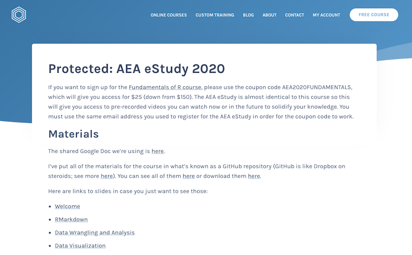
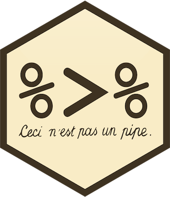
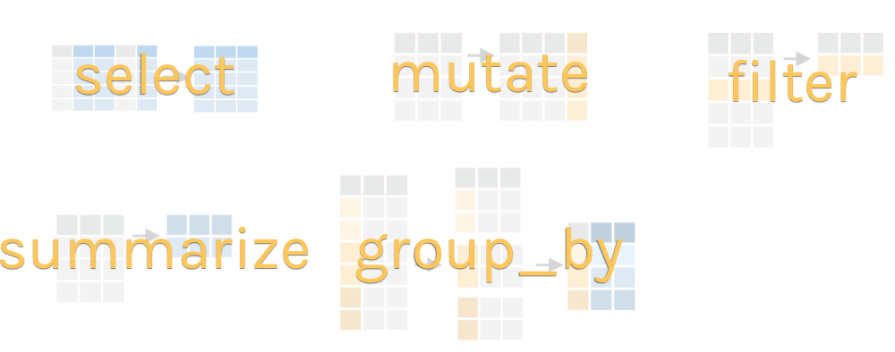

```{r setup, include=FALSE}
knitr::opts_chunk$set(eval = F, 
                      warning = F,
                      message = F)

library(tidyverse)
library(skimr)
library(janitor)
library(here)
library(kableExtra)


```


```{r include = F, eval = T}

# This is just because the presentation file is in a subdirectory so need to actually load it but don't want to confuse folks.

nhanes <- read_csv(here("data/nhanes.csv")) %>% 
  clean_names()

```

class: center, middle, inverse, dk-section-title

## Welcome Back!

---

## Review of RMarkdown

--

What questions do you have?

---

## Parameterized Reporting

--

Check out [this article from the Urban Institute](https://medium.com/@urban_institute/iterated-fact-sheets-with-r-markdown-d685eb4eafce)

---

## Info on Website

[](https://rfortherestofus.com/client/aea-estudy-2020/)

---

## Today's Materials

[Slides](https://rfortherestofus.github.io/intro-to-r-aea-2020/slides/03-data-wrangling-and-analysis-slides.html#1)

[Examples](https://github.com/rfortherestofus/intro-to-r-aea-2020/blob/master/03-data-wrangling-and-analysis-examples.Rmd)

[Solutions](https://github.com/rfortherestofus/intro-to-r-aea-2020/blob/master/03-data-wrangling-and-analysis-solutions.Rmd)

---

## Ask For Help in the Google Doc

https://rfortherestofus.com/aea-estudy-notes/

--

If you see a question or issue you're having too, add a +

--

If you're having trouble, others likely are too!


---

## How to Tell Me When You're Done

https://rfortherestofus.com/done/

---


## NHANES

.pull-left[
*"The National Health and Nutrition Examination Survey (NHANES) is a program of studies designed to assess the health and nutritional status of adults and children in the United States. The survey is unique in that it combines interviews and physical examinations."*
]

.pull-right[

]

???

Website: https://www.cdc.gov/nchs/nhanes/index.htm

Video: https://www.youtube.com/watch?v=GmnN2r5J0YA

R package: https://cran.r-project.org/web/packages/NHANES/index.html


---

class: inverse, center, middle, dk-section-title

background-image: url("images/tidyverse-website.png")

# The tidyverse

---

## Base R Syntax


--

```{r}
table(nhanes$education,
      nhanes$phys_active)
```

--

- Starts with function, data frame in parentheses

--

- Uses dollar sign notation (data_frame$variable)

--

- Requires repeating data frame name each time you call it

---


## Tidyverse Syntax


```{r}
nhanes %>% 
  tabyl(education, phys_active)

```

--

- "data frame first, data frame once" - [Alison Hill](https://ohsu-conj620.netlify.com/slides/cm012.html#20)

--

- Uses the pipe (%>%) to chain together a series of functions


---

class: center, middle

## The pipe



---

### The pipe

Using the pipe, we can start with a data frame and then conduct a series of functions all at once. Read each pipe as "then."

```{r}
nhanes %>% 
  filter(survey_yr == "2009_10") %>% 
  group_by(education) %>% 
  summarize(mean_bmi = mean(bmi, na.rm = TRUE))

```

--

*Keyboard shortcut to add a pipe: command-shift-M (Mac) or control-shift-M (Windows).*


---

class:inverse

### Your Turn


1. Open the 03-data-wrangling-and-analysis-exercises.Rmd file

--

1. Load the `tidyverse` package

--

1. Import NHANES data to a data frame called `nhanes`


---

## Data Wrangling and Analysis Verbs



